# Tôi đã hack công ty X và xâm nhập vào server như thế nào?


> Vì lý do bảo mật và riêng tư nên mình xin phép giấu tên công ty X

* Target: tập đoàn Nhật Bản có chi nhánh công ty X tại Việt Nam, tạm gọi site target là X-vietnam.com

* Bug đã được report 2 tháng trước, bên X đã tiếp nhận và fix lỗi

### 1.Xem sơ bộ site X:

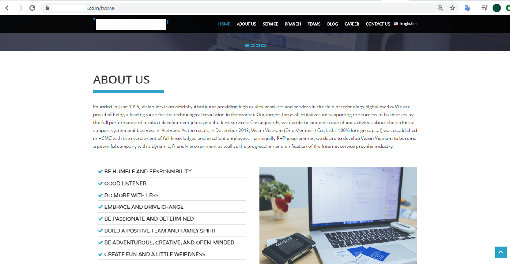

* Giao diện không gì đặt biệt chỉ toàn là css và js, không có form input hay param nào để truyền value vào -> khó có cơ hội để fuzz ở trên domain này, nên đem vào burp bắt request trang chủ xem có gì hot

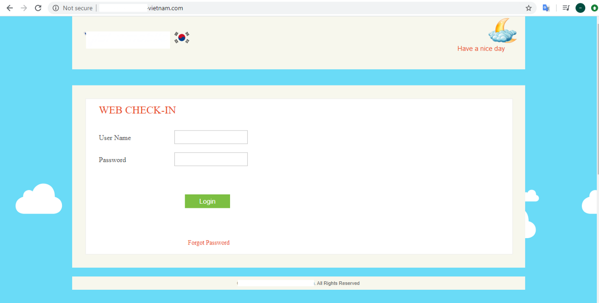

* Có 1 endpoint xử lý api, fuzz thử thì lụm luôn acc admin

### 2.Tiến hành recon thu thập thông tin

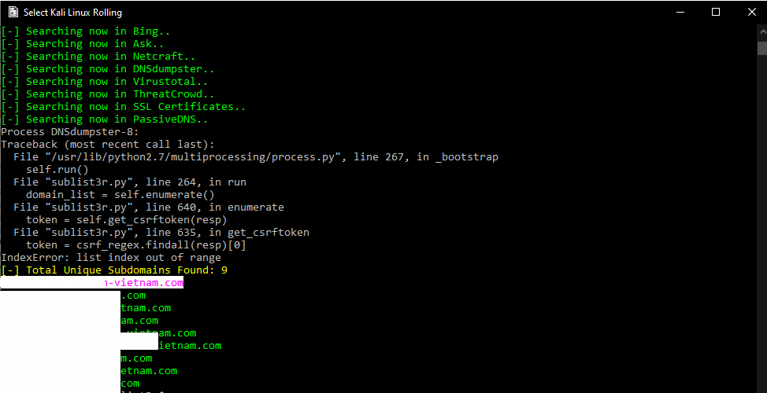

* Kết quả trả về 9 domain chung server

### 3.Tiến hành tấn công vào target

* Bước đầu tiên thu được username, email và password của admin, password là dạng hash md5, do đặt pass độ khó cao nên không thể crack -> Failed

* Sử dụng kết quả trả về 9 domain cùng server của sublist3r ở trên, chọn 1 domain cùng server tạm gọi là site1.x-vn.com để check

* Kịch bản: 

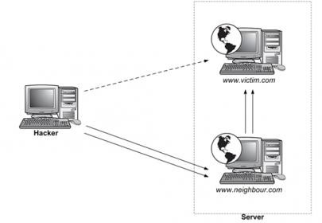

* Server sẽ có thể chứa nhiều site, ta có thể thông qua site cùng server để local attack đến target chính.


* Đây là giao diện web của site1.X-vn.com

* Ở đây giao diện chỉ có 1 form login, ta có 3 case để test

```
+ Broken Authentication

+ SQL Injection

+ Missing function level access control
```

* Đưa site vào burpsuite để bắt request

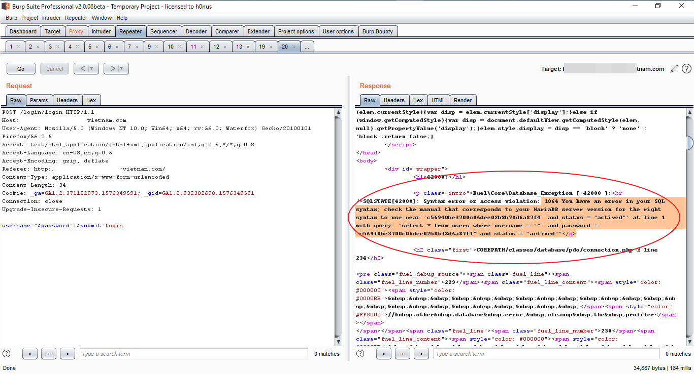

* Truyền giá trị ‘ “ ‘ vào param username, ta thấy reponse trả về là thông báo lỗi SQL -> Có khả năng khai thác được SQL injection

* Công cụ tiếp theo sử dụng : Sqlmap

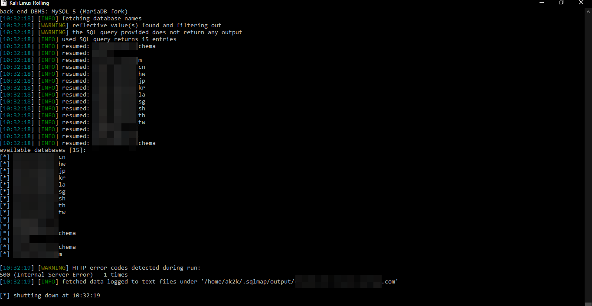

* Kết quả trả về cho thấy đã khai thác thành công và rất nhiều database trên server và có 1 database là “ Homepage” => Có khả năng làm được theo kịch bản nếu upload được shell

* Để upload được shell bằng SQL injection thì phải cần đáp ứng 2 điều kiện:
  
  * Biết được chính xác path của server

  * User phải có quyền ghi vào thư mục

* Quá trình lên shell mysql gồm có 2 cách:

  * Cách 1 : Dùng INTO OUTFILE để ghi code vào và them file lên server
  
  * Cách 2: Ghi ra log bằng cách
  
    ```
     SET global general_log=on;


    SET global general_log_file='/var/www/html/shell.php'


    SELECT '<?php passthru($_GET[1]); ?>'
    ```

* Cả 2 cách đều cần phải biết path của server

* Để xem quyền của user hiện tại thì mình dùng lệnh –privileges trên sqlmap

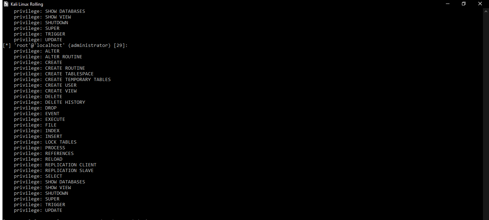

* Kết quả trả về như mong muốn, user hiện tại là root@localhost, và có gần như full quyền

* Tiếp theo là xem file etc/passwd của server

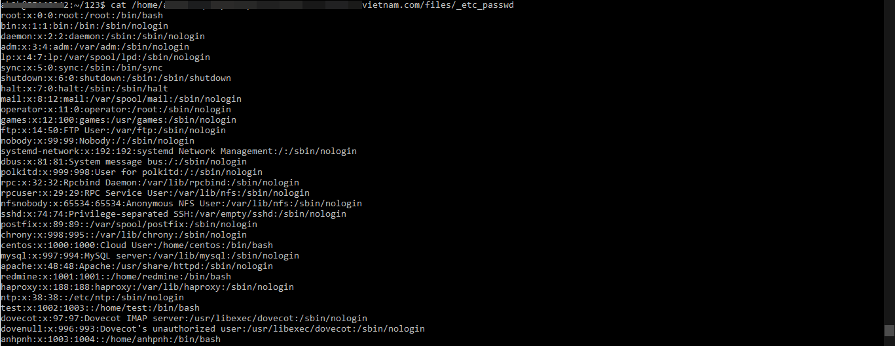

* Có thể đọc được file passwd, Mình đã có thử ghi file vào thư mục /tmp trên server, kết quả là thành công nhưng không lưu ảnh nên không up lên được, tuy nhiên upload lên tmp không thể truy cập vào trừ khi LFI. Vậy nên cần tìm path chính xác của server để có thể truy cập con shell mà mình up.

* Bước tiếp theo là hướng tới 1 subdomain khác trên server tạm gọi là site2.X-vietnam.com, và fuzz ra được file phpinfo() tên là test.php ở root

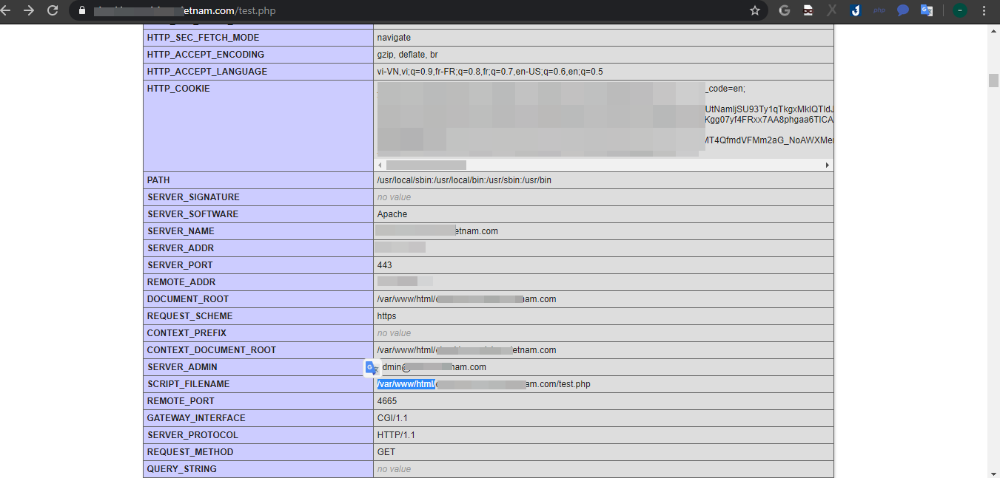

* Ta thu được chính xác những thông tin cần tìm, Path chính xác của site là “/var/www/html/site2.X-vietnam.com/ “ . Mình đã thử ghi file vào nhưng không được vì user hiện tại không có quyền ghi vào thư mục này, nên bước tiếp theo để có thể ghi được là thư mục phải có quyền ghi ( ví dụ chmod 777 ). Việc cần làm ở đây là phải tìm ra thư mục đó

* Công cụ sử dụng: Dirsearch

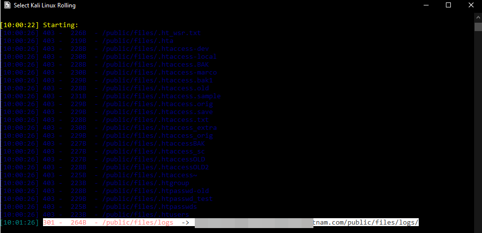

* Phát hiện ra thư mục /public/files/logs/ trên site2.X-vietnam.com và có thể access nên mạnh dạng đoán là thư mục có quyền ghi nên thử ghi file vào

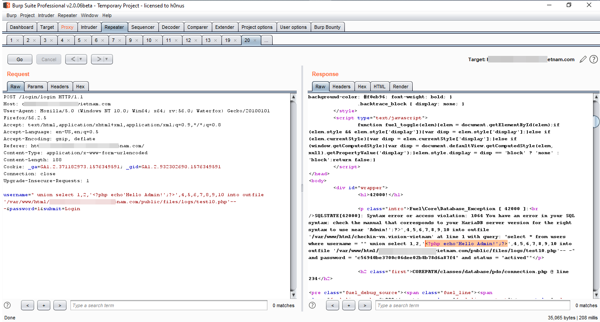

* Kết quả trả về là 1 thông báo lỗi, chắc do không thực thi được hàm trong php, echo mà bị chặn thì chắc những hàm execute lệnh chắc không khả thi. Suy nghĩ một hồi, mình nhớ ra có thể sử dụng 1 bug của php, không cần gọi hàm system mà vẫn thực thi được shell

```<?=`$_GET[1]`?>```

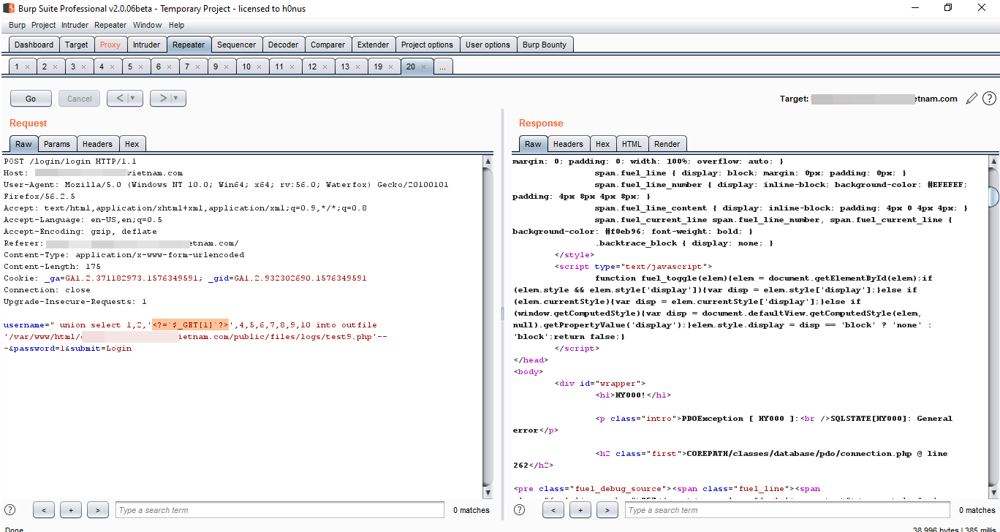

* Response không còn trả về lỗi nữa, thử access vào con shell vừa up và run lệnh id

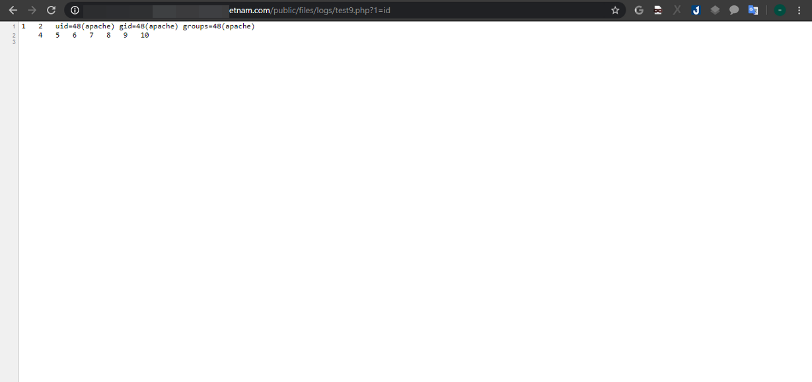

* Vậy là ta đã thực thi được con shell, ls đến var/www/html, thì có rất nhiều domain, bao gồm cả site chính

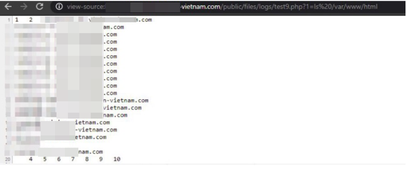

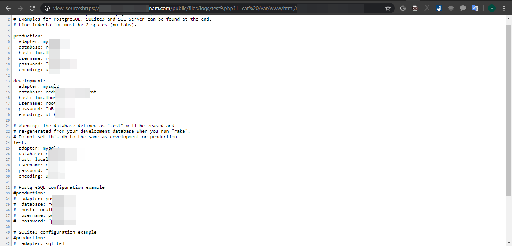

* Có thể truy cập và get config của site, vậy là ý tưởng đã thành công , Và cuối cùng là chiếm được mail của target X

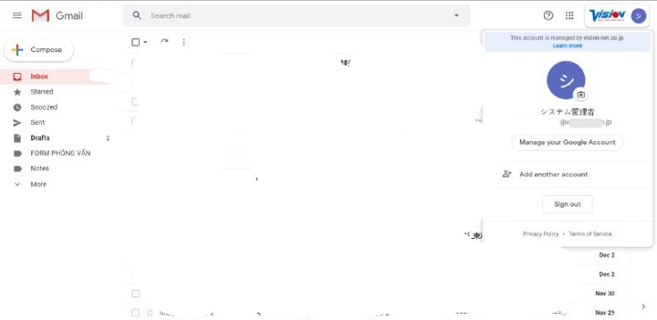

